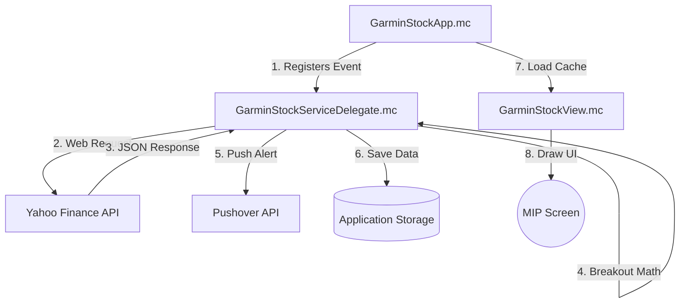

# Garmin Connect IQ Stock & Futures Watch Face

A high-performance, battery-optimized Garmin watch face written in **Monkey C** (Garmin Connect IQ SDK), specifically designed for the **Instinct 2X** monochrome Memory-In-Pixel (MIP) display. 

This project integrates real-time stock/futures tracking, custom visual rendering, and cross-platform push notifications, making it an excellent demonstration of software engineering under strict memory, processing, and battery constraints.

---

## 🚀 Key Technical Features

### 1. Battery-Saving Dynamic Background Scheduler
Garmin background tasks traditionally poll at fixed intervals, which drains the watch's battery. This project implements a **smart market-hours scheduler**:
* **Market-Aware Sleep Mode**: The background delegate parses exchange metadata (`currentTradingPeriod`) from Yahoo Finance. When the market closes (weekends, nights, or holidays), the watch calculates the exact time until the next pre-market session (4:00 AM EDT) and puts the background delegate to sleep for that entire duration (e.g., 288,000 seconds over a weekend).
* **Zero Overhead**: Completely eliminates unnecessary network calls and CPU wakeups during off-market hours, maximizing watch battery life.

### 2. High-Priority Push Alerts & Watch Vibration (Sandbox Workaround)
Due to Garmin SDK security sandboxing, watch faces are restricted from calling the `Attention.vibrate()` API directly.
* **Notification Tunneling**: Built a custom integration with the **Pushover API**. When a price breakout is detected, the background task triggers a POST request to Pushover with a high-priority flag (`priority: 1`).
* **Haptic Feedback**: This bypasses phone/watch quiet hours to trigger immediate phone vibration, which seamlessly translates to a Bluetooth smart notification and physical watch vibration.

### 3. Self-Contained Memory-Efficient Breakout Logic
* Garmin background processes on low-power devices like the Instinct 2X are capped at **32KB of RAM**.
* Implemented a self-contained array-based min/max scanner over incoming 60-minute price arrays to calculate price breakouts (new 60-min highs/lows) without reading from or writing to `Application.Storage` inside the background task, avoiding file-locking issues and saving precious memory.

### 4. Dynamic Holiday-Adjusted Countdown Timer
* During off-market hours, the watch face dynamically swaps the stock line graph for a centered countdown timer formatted as `HH:MM:SS` (e.g., `68:21:05` until the Sunday overnight opening at 8:00 PM EDT).
* Automatically skips market holidays by parsing future trading period starts directly from Yahoo Finance metadata.
* Adjusts for local timezone offsets (`System.getClockTime().timeZoneOffset`) to prevent UTC mismatches.

### 5. Memory-In-Pixel (MIP) UI Layout Design
* Layout coordinates are optimized for the Instinct 2X's unique 176x176 monochrome screen.
* Aligns the countdown timer left-edge to `X = 12` to match the battery progress bar.
* Features a custom visual alert banner on price breakouts, step count goals progress indicator, and custom font rendering.

---

## 🛠️ Project Architecture

The codebase follows the Connect IQ MVC/Delegate pattern:



* **[GarminStockApp.mc](file:///source/GarminStockApp.mc)**: Manages lifecycle, handles data returned from the background delegate, and configures startup scheduling safely.
* **[GarminStockServiceDelegate.mc](file:///source/GarminStockServiceDelegate.mc)**: Operates in a separate background process; fetches Yahoo Finance charts, handles parsing, evaluates breakouts, and fires Pushover notifications.
* **[GarminStockView.mc](file:///source/source/GarminStockView.mc)**: Renders the time, steps, battery status, stock graphs, and off-market countdowns directly onto the canvas.

---

## 📖 How to Build & Run

### Prerequisites
* Garmin Connect IQ SDK (v4.0.0 or higher)
* JDK 17
* VS Code with the Monkey C Extension (or command-line tools)

### Build Commands
Compile the watch face for the Instinct 2X target:
```powershell
monkeyc -f monkey.jungle -o bin\GarminStock.prg -y developer_key.der -d instinct2x
```

Launch the Garmin Simulator and load the watch face:
```powershell
monkeydo bin\GarminStock.prg instinct2x
```
